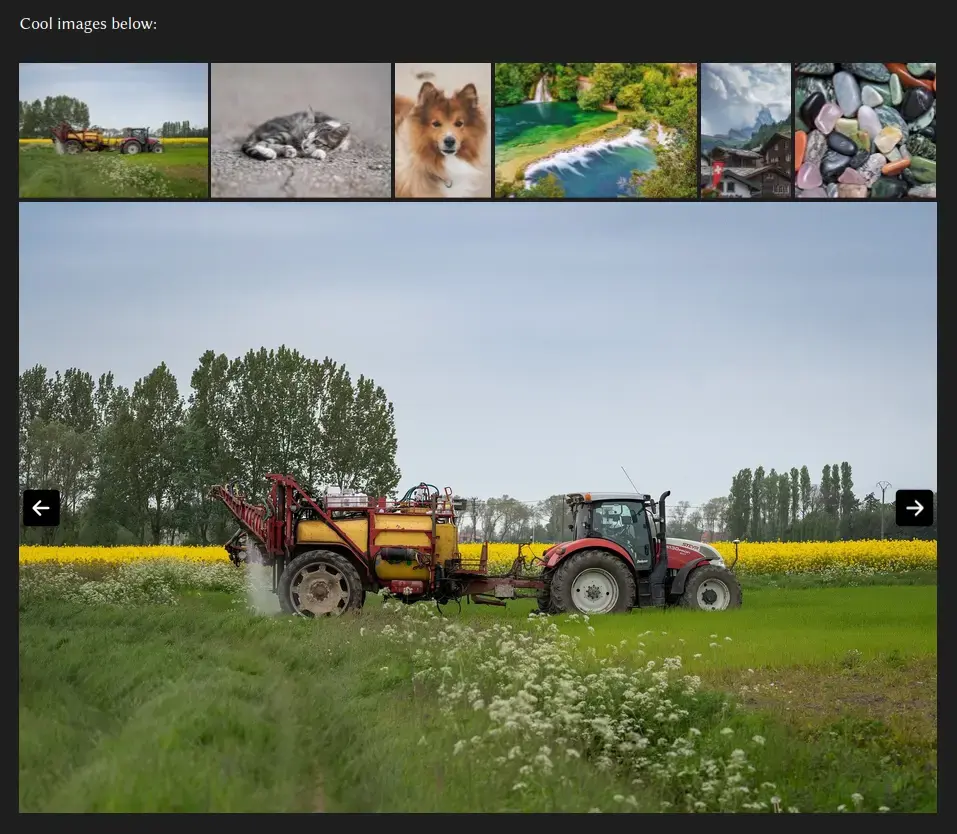

# simple-slideshow-hugo


Images: [1](https://pixabay.com/photos/agriculture-tractor-farming-8275498/) [2](https://pixabay.com/photos/cat-kitten-animal-domestic-mammal-8260638/) [3](https://pixabay.com/photos/dog-puppy-canine-pet-animal-cute-8262506/) [4](https://pixabay.com/photos/krka-river-waterfall-cascades-8274679/) [5](https://pixabay.com/photos/mountain-village-houses-alps-8190836/) [6](https://pixabay.com/photos/stones-pebbles-minerals-quartz-8249322/)\
Theme: [simple-hugo](https://github.com/D00NIK/simple-hugo)\
Arrow SVG: Edited and downloaded from [here](https://www.svgrepo.com/svg/521961/arrow-left-square)

Pros:
- Clean, efficient code
- Not using any JS framework, library and other bloat
- Lazy loading
- Easy set-up

Cons:
- Basic design
- Not much configuration (unless you won't touch code, but you **should**)
- One per page since I didn't use any uid's for classes and js

## Usage

1. Clone into `themes`:

```bash
cd my-fun-site
git clone https://github.com/D00NIK/simple-slideshow-hugo themes/simple-slideshow-hugo
```

2. Add to `theme` in `hugo.toml` (or other extension):
   
```toml
theme = ['your-cool-theme', 'simple-slideshow-hugo']
```

3. Use as [shortcode](https://gohugo.io/content-management/shortcodes/) in content:

```md

```

Note that it's intended to be used in [leaf bundles](https://gohugo.io/content-management/page-bundles/#leaf-bundles). Two examples below:

```
content/
├── posts
│   ├── my-first-post
│   │   ├── image1.jpg
│   │   ├── image2.png
│   │   └── index.md        --> use shortcode here
│   ├── my-second-post
│   │   ├── img
│   │   │   ├── image1.jpg
│   │   │   └── image2.png
│   │   └── index.md        --> or like here
```

## Configuration

- `dir` - default: `/` - change where the shortcode looks for images
- `icon` - default: `svg/simple-slideshow-arrow.svg` - path to an arrow svg. Will use it as a resource, so you must put it in the assets folder.
- `loopImages` - default: `false` - trying to get image after last/before first with cause it to go back to the beginning/end
- `topSlideBar` - default: `true` - slidebar for thumbnails on top
- `scrollIntoView` - default: `true` - when changing slide scrolls if the image is outside of user's vision
- `maxThumbnailHeight` - default: 150 - max thumbnail height in px.
- `sortOrder` - default: `asc` - thumbnails sortOrder. For descending `desc`.

Example:

```md

```

## To Do

- ❌ Automatically optimize images
- ✅ Allow multiple per page
- ✅ Page jumping fix
- ✅ Sorting option
